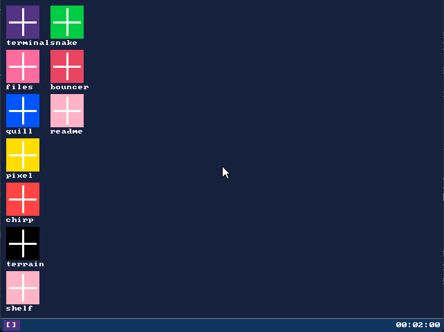

# momOS

A handmade fantasy workstation OS that runs on real hardware. 32-bit x86 bare-metal kernel with a Lua scripting environment, windowed desktop, sprite editor, music tracker, map editor, and code editor — all built from scratch.



## What it is

momOS boots on real x86 hardware (tested on a Presario 5000 and an Acer Aspire 1). It runs a Lua 5.4 interpreter directly in the kernel with a custom windowing system, filesystem, and hardware drivers. Everything you see on screen is written in either C or Lua — no host OS, no runtime, no dependencies at boot.

**Built-in apps:**
- **Quill** — Lua code editor with syntax highlighting, line numbers, tab-complete, and inline error display
- **Pixel** — Sprite editor with layers, animation frames, palette editor, and onion skinning
- **Chirp** — 4-channel tracker with 16 instrument presets and 8 effects
- **Terrain** — Tile map editor supporting sprite sheet import and object layers
- **Files** — File manager with copy/cut/paste and app associations
- **Shelf** — Asset browser with thumbnail previews
- **Snake** — Playable example game (also a template for writing your own)

## Building

### Requirements

**MSYS2 / UCRT64** (Windows) — install with:
```
pacman -S mingw-w64-ucrt-x86_64-i686-elf-gcc \
          mingw-w64-ucrt-x86_64-i686-elf-binutils \
          mingw-w64-ucrt-x86_64-nasm make
```

**QEMU** (for running):
```
pacman -S mingw-w64-ucrt-x86_64-qemu
```

**WSL2** (for ISO builds only) — install with:
```
sudo apt install grub-pc-bin grub-common xorriso mtools
```

### Build and run (QEMU)

From MSYS2:
```bash
make        # builds kernel.bin + initrd.lfs + host tools
make run    # boots in QEMU (SDL window)
```

### Build ISO for real hardware

From WSL2 (run `make` in MSYS2 first):
```bash
make iso    # produces momos.iso
```

Then flash with [Rufus](https://rufus.ie/) — choose **DD mode** when prompted.

### Other targets

```bash
make run-iso        # boot momos.iso in QEMU (from MSYS2)
make run-serial     # headless serial-only boot (debugging)
make test           # run VFS unit tests
make clean          # remove build artifacts
make clean-disk     # delete disk.img (resets saved state)
```

## Running on real hardware

1. Build the ISO from WSL2: `make iso`
2. Flash to a USB drive with Rufus in **DD mode**
3. In BIOS: disable Secure Boot, enable Legacy/CSM boot, set USB first in boot order
4. Boot — GRUB menu appears after 5 seconds, momOS starts automatically

**Known hardware support:**
| Machine | Display | Keyboard | Mouse | Disk | Audio |
|---------|---------|----------|-------|------|-------|
| Presario 5000 (2001) | VESA 640×480 | PS/2 | PS/2 | PATA ATA PIO | AC97 |
| Acer Aspire 1 (2009) | VESA 640×480 | PS/2/USB | Touchpad (may vary) | SATA (needs IDE compat mode in BIOS) | HDA (no driver — silent) |

**Saving files to disk:** In the terminal, run `sys.save()` after making changes. Files live in the VFS (in RAM) until then.

## Writing apps

Every app is a `.lua` file in `initrd/apps/` that returns a table with `draw`, `update`, and `input` callbacks:

```lua
local win = wm.open("Hello", 200, 150, 240, 80)

local function draw()
  wm.focus(win)
  gfx.cls(2)
  gfx.print("Hello, momOS!", 20, 30, 7)
  wm.unfocus()
end

local function on_input(c)
  if c == "\x1b" then wm.close(win); return "quit" end
end

return { draw=draw, update=function() end, input=on_input, win=win, name="Hello" }
```

For games, use the included `lib/game.lua` framework — see `initrd/apps/snake.lua` for a complete example.

**Full API reference:** `docs/api_reference.md`  
**File format specs:** `docs/lfs_format.md`, `docs/mpi_format.md`, `docs/msm_format.md`, `docs/mtm_format.md`

## Project structure

```
kernel/         C kernel source
  boot/         multiboot entry point (ASM)
  cpu/          GDT, IDT, PIT, keyboard, mouse, serial
  mm/           physical allocator, paging, heap
  vfs/          LFS filesystem driver
  wm/           window manager + compositor
  ipc/          message queue
  proc/         process table + scheduler
  audio/        AC97 driver, PC speaker, software mixer
  disk/         ATA PIO driver
  lua/          Lua kernel bindings (klua.c)
lua/            Lua 5.4.7 source (vendored)
initrd/         initial RAM disk contents
  sys/          main.lua (desktop shell)
  apps/         built-in applications
  lib/          shared libraries (game.lua)
  home/         user home directory (empty at boot)
tools/          host build tools (mklfs, lfs_inspect, mkdisk)
docs/           format specs and API reference
linker.ld       kernel linker script
Makefile        build system
```

## How it works

- **Boot:** GRUB2 loads the kernel via Multiboot1 with a VESA 640×480×32 framebuffer
- **Kernel:** Single-address-space i686 kernel; no user mode, no virtual memory beyond the boot identity map
- **Lua:** Single global Lua state; all apps run cooperatively via a debug-hook preemption scheduler (2000-instruction budget per tick)
- **Filesystem:** LFS (Luminos Filesystem) — a simple block-based format stored in RAM from the initrd module, with optional ATA PIO persistence to a dedicated partition
- **Windowing:** Software compositor; each window has an off-screen pixel buffer that gets blitted to the framebuffer each frame

## License

MIT
