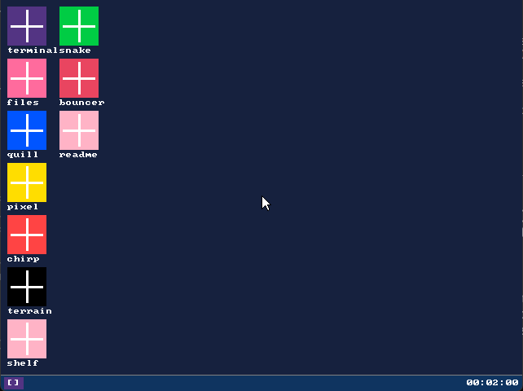

# momOS

A handmade fantasy workstation OS that runs on real x86 hardware — or as a native desktop app on Windows, Linux, and macOS via SDL2. 32-bit bare-metal kernel, Lua scripting environment, windowed desktop, sprite editor, music tracker, map editor, text editor, file manager, and games — all built from scratch.



---

## What it is

momOS boots on real x86 PC hardware (tested on a Presario 5000 and an Acer Aspire 1). It runs Lua 5.4 directly in the kernel with a custom windowing system, filesystem, audio mixer, and hardware drivers. There is no host OS at runtime — everything visible on screen is written in C or Lua.

It also runs as a normal native binary on Windows/Linux/macOS via SDL2 (no emulator needed), making development fast and accessible.

**Built-in apps:**
| App | Description |
|-----|-------------|
| **Terminal** | Drop-down shell with Lua REPL and file commands |
| **Quill** | Text / code editor (vi-style commands) |
| **Pixel** | Sprite editor — layers, animation frames, palette editor |
| **Chirp** | 4-channel music tracker |
| **Terrain** | Tile map editor with sprite sheet import |
| **Files** | File manager with copy/cut/paste |
| **Shelf** | Asset browser with thumbnail previews |
| **Settings** | Clock, display, theme, audio, and system panel |
| **Snake** | Playable snake game (template for writing your own) |
| **Bouncer** | Physics toy |
| **Asteroid** | Asteroids clone — vector ship, splitting rocks, screen wrap |
| **Todo** | Nested todo list with debounced autosave and heading sidebar |
| **Maze3D** | First-person raycasting maze — DDA renderer, procedural maze gen, minimap |

---

## Quick start — hosted mode (no QEMU, no hardware)

The fastest way to run momOS is the hosted build. It produces a native binary that uses SDL2 instead of bare metal.

### Requirements (MSYS2 UCRT64)

```
pacman -S mingw-w64-ucrt-x86_64-SDL2 make gcc
```

### Build and run

```bash
make hosted       # builds momos.exe + initrd.lfs
make run-hosted   # opens momOS in a 1024×600 window
```

### Portable distribution

```bash
make dist         # copies momos.exe + SDL2.dll + initrd.lfs + disk.img → dist/
```

Send `dist/` to anyone — double-click `momos.exe` to run, no MSYS2 or QEMU needed. Saves persist in `disk.img` next to the exe.

---

## Building for QEMU / real hardware

### Additional requirements (MSYS2 UCRT64)

```
pacman -S mingw-w64-ucrt-x86_64-i686-elf-gcc \
          mingw-w64-ucrt-x86_64-i686-elf-binutils \
          mingw-w64-ucrt-x86_64-nasm \
          mingw-w64-ucrt-x86_64-qemu
```

ISO builds also require WSL2:
```
sudo apt install grub-pc-bin grub-common xorriso mtools
```

### Build targets

```bash
make              # build kernel.bin + initrd.lfs + host tools
make run          # boot in QEMU (multiboot, SDL window)
make run-iso      # boot momos.iso in QEMU (from MSYS2)
make iso          # build bootable ISO (run from WSL2 after make)
make run-serial   # headless serial-only (debug)
make test         # run VFS unit tests
make clean        # remove build artifacts
make clean-disk   # delete disk.img (reset saved state)
```

### Build ISO and boot real hardware

1. Run `make` in MSYS2, then `make iso` in WSL2 — produces `momos.iso`
2. Flash to USB with [Rufus](https://rufus.ie/) — choose **DD mode** when prompted
3. In BIOS: disable Secure Boot, enable Legacy/CSM boot, set USB first in boot order
4. Boot — GRUB appears briefly, momOS starts automatically

**Tested hardware:**
| Machine | Display | Audio |
|---------|---------|-------|
| Compaq Presario 5000 (2001) | VESA 640×480 | AC97 ✓ |
| Acer Aspire 1 (2009) | VESA 1024×600 | HDA (silent — driver present but untested) |

SATA drives: enable IDE compatibility mode in BIOS to allow ATA PIO access.

---

## Desktop

### Layout

```
┌─────────────────────────────────────────────────┐
│  [icon]    [icon]    [icon]  ...                 │  ← desktop icons (click to open)
│  label     label     label                       │
│                                                  │
│   ┌──────────────────────────┐                   │
│   │ Window Title         [×] │                   │  ← app windows
│   │ (app content here)       │                   │
│   └──────────────────────────┘                   │
│                                                  │
│ ┌──────────────────────────────────────────────┐ │
│ │ []  [terminal]  [pixel]  ...   HDD  12:34:56 │ │  ← taskbar
│ └──────────────────────────────────────────────┘ │
└─────────────────────────────────────────────────┘
```

### Mouse

| Action | Result |
|--------|--------|
| Click desktop icon | Launch app |
| Click taskbar button | Focus / raise app |
| Right-click taskbar button | Close app |
| Right-click desktop | Context menu (open terminal, settings, new folder, etc.) |
| Drag window title bar | Move window |
| Double-click title bar | Maximize / restore |
| Click `[×]` in title bar | Close window |

### Keyboard

| Key | Action |
|-----|--------|
| `` ` `` (backtick) | Toggle drop-down terminal |
| `Ctrl+S` | Save VFS to disk (from anywhere) |
| `F4` | Close focused app |

### Custom desktop icons

Any app icon can be replaced with a custom `.mpi` sprite:

1. Open **Pixel** and draw a 16×16 or 32×32 sprite
2. Type `:icon <appname>` (e.g. `:icon terminal`) — saves to `/sys/icons/<appname>.mpi`
3. The desktop refreshes within ~2 seconds

Delete `/sys/icons/<name>.mpi` via the terminal to revert to the built-in icon.

### Taskbar

- **`[]`** button (left) — right-click the desktop to open context menu
- **App buttons** — one per open window; highlighted = focused, dimmed = minimized
- **HDD** badge (right) — shows when a disk partition is mounted
- **Clock** (far right) — shows current time; format set in Settings

### Wallpaper and theme

Right-click the desktop → **Settings** to change the color scheme and wallpaper. Five built-in themes: Dark, Green, Amber, Light, Purple.

---

## Terminal

Press `` ` `` to open or close. Resize by dragging the bottom edge.

The terminal is a Lua REPL — anything typed is executed as Lua code. The following shell-style commands are also available:

| Command | Description |
|---------|-------------|
| `ls [path]` | List directory (default: current) |
| `cd <path>` | Change current directory |
| `cat <file>` | Print file contents |
| `run <file>` | Execute a Lua app file |
| `open <file>` | Open a file in its associated app |
| `write <file>` | Write mode: type lines, `.` alone to save, `Esc` to cancel |
| `mkdir <dir>` | Create directory |
| `rm <path>` | Delete file or directory |
| `ps` | List running apps |
| `kill <name>` | Close an app by name |
| `save` | Save VFS to disk |
| `load` | Reload VFS from disk |
| `clear` | Clear terminal output |
| `help` | Print command list |

**Lua REPL examples:**
```lua
print(sys.ticks())               -- tick counter
= 1 + 1                          -- print expression result (= prefix)
fs.list("/apps")                 -- list files as Lua table
sys.save()                       -- save to disk programmatically
audio.set(0, 0, 440, 200)        -- play A4 on channel 0
audio.stop_all()                 -- stop all audio
```

---

## Quill — text / code editor

Open from the desktop or via `open <file>` in the terminal.

### Commands (press `:` to enter command mode)

| Command | Action |
|---------|--------|
| `:w` | Save (current filename) |
| `:w <path>` | Save as path |
| `:o <path>` | Open file |
| `:q` | Quit (warns if unsaved) |
| `:wq` | Save and quit |
| `:help` | Open docs |

### Keyboard (normal mode)

| Key | Action |
|-----|--------|
| Arrow keys | Move cursor |
| `Page Up/Down` | Scroll page |
| `Home / End` | Line start / end |
| `Backspace / Delete` | Delete character |
| `Enter` | New line |
| `Tab` | Insert tab / indent |
| `Ctrl+S` | Quick save |

---

## Pixel — sprite editor

Create and edit `.mpi` sprite files with layers, animation frames, and a built-in palette editor.

### Toolbar (left panel)

| Tool | Description |
|------|-------------|
| **Pen** | Draw single pixels |
| **Era** | Erase to transparent |
| **Fill** | Flood fill |
| **Line** | Draw straight line |
| **Rect** | Draw filled rectangle |
| **Circ** | Draw circle outline |
| **Sel** | Rectangular selection (cut/copy/paste) |
| **Pick** | Sample color from canvas |

### Controls

| Key / Action | Effect |
|-------------|--------|
| Left-click | Apply tool |
| Right-click (canvas) | Pick color |
| Scroll wheel | Zoom in/out |
| `0`–`9` | Select palette color 0–9 |
| Arrow keys (palette) | Navigate colors |
| `Ctrl+Z` | Undo last stroke |
| `s` | Quick save |

### Commands (press `:`)

| Command | Action |
|---------|--------|
| `:w <path>` | Save file (`.mpi` added if no extension) |
| `:o <path>` | Open file |
| `:n [WxH]` | New canvas (default 16×16) |
| `:wq` | Save and quit |
| `:q` | Quit |
| `:+f` | Add animation frame |
| `:-f` | Remove last frame |
| `:icon <name>` | **Save as desktop icon for app `<name>`** |

### Custom desktop icons

1. Create a **32×32** sprite (`:n 32x32`)
2. Draw your icon using the system palette
3. Type `:icon terminal` (or any app name)
4. The desktop updates within ~2 seconds

To revert to the built-in icon, delete `/sys/icons/<name>.mpi` via the terminal.

---

## Chirp — music tracker

4-channel software synthesizer and step sequencer. Saves/loads `.msm` files.

### Layout

```
┌─ Song order ──┬─ Pattern editor ──────────────────┐
│ [01][02]...   │  Row │ Ch1      Ch2      Ch3  Ch4  │
│               │  001 │ C-4 01-- │ ------- │ ...    │
│               │  002 │ ...      │         │        │
└───────────────┴────────────────────────────────────┘
[Instrument list]      BPM: 120   Ticks: 6
```

### Controls

| Key / Action | Effect |
|-------------|--------|
| Arrow keys | Move cursor in pattern |
| `Space` | Play / stop |
| Note keys (row in focus) | Enter notes: `a`=C `w`=C# `s`=D `e`=D# `d`=E `f`=F `t`=F# `g`=G `y`=G# `h`=A `u`=A# `j`=B |
| `Del` | Clear current cell |
| `+` / `-` | Adjust BPM |
| `[` / `]` | Previous / next pattern |
| `Ctrl+S` | Save |

---

## Terrain — tile map editor

Create tile maps using a sprite sheet. Saves/loads `.mtm` files.

### Controls

| Key / Action | Effect |
|-------------|--------|
| Left-click (map) | Place selected tile |
| Right-click (map) | Pick tile |
| Arrow keys | Pan map |
| Click tile palette | Select tile |
| `Ctrl+S` | Save |
| `+` / `-` | Zoom |

---

## Files — file manager

Browse and manage the VFS. Double-click files to open them in their associated app.

### Controls

| Key / Action | Effect |
|-------------|--------|
| Click file / folder | Select |
| Double-click folder | Enter directory |
| Double-click file | Open in associated app |
| Right-click | Context menu (copy, cut, paste, delete, rename) |
| Backspace | Go up one directory |

**File associations:**
| Extension | Opens in |
|-----------|----------|
| `.lua` | Executes as app |
| `.mpi` | Pixel editor |
| `.msm` | Chirp tracker |
| `.mtm` | Terrain editor |
| Any text file | Quill editor |

---

## Settings

Open from the desktop icon or right-click the desktop → Settings.

### Panels

**Clock**
- Format: 12-hour or 24-hour
- Source: RTC (hardware clock) or Manual
- Manual mode: set year, month, day, hour, minute, second
- Timezone offset: ±23 hours

**Display**
- Wallpaper: palette color index (0–31)
- Resolution info

**Theme**
- Five presets: **Dark** · **Green** · **Amber** · **Light** · **Purple**
- Applied immediately, saved on close

**Audio**
- Shows detected audio backend (AC97 / HDA / PC speaker / SDL)

**System**
- **Shutdown** — proper ACPI power-off
- **Reboot** — keyboard controller reset

Settings are saved to `/sys/settings.lua` and loaded automatically at boot.

---

## Saving files

All files live in the LFS (Luminos Filesystem) in RAM. Changes are lost on reboot unless saved to disk.

**Save:** press `Ctrl+S` anywhere, run `save` in the terminal, or use Settings → System.

**Disk requirements (real hardware):** A disk with an LFS partition is required. Create one with:
```bash
make disk.img       # creates a 20 MB disk image (for QEMU)
./tools/mkdisk disk.img 20
```

On real hardware, partition with type `0x4C` using `fdisk` and format using `mklfs`.

---

## Writing apps

Every app is a Lua file in `initrd/apps/` that returns a table:

```lua
local win = wm.open("Hello", 200, 150, 240, 80)

local function draw()
  wm.target(win)
  gfx.cls(2)
  gfx.print("Hello, momOS!", 20, 30, 7)
  wm.untarget()
end

local function update() end

local function on_input(c)
  if c == "\x1b" then return "quit" end
end

return { draw=draw, update=update, input=on_input, win=win, name="hello" }
```

### Lua API overview

**Graphics (`gfx`)**
```lua
gfx.cls(col)                     -- clear screen to palette color
gfx.pset(x, y, col)              -- set pixel
gfx.pget(x, y)                   -- get pixel color index
gfx.rect(x, y, w, h, col)        -- filled rectangle
gfx.line(x0, y0, x1, y1, col)    -- line (Bresenham)
gfx.circ(cx, cy, r, col)         -- circle outline
gfx.circfill(cx, cy, r, col)     -- filled circle
gfx.print(text, x, y, col)       -- 8×8 bitmap text
gfx.set_pal(idx, r, g, b)        -- set palette entry (0–31)
gfx.get_pal(idx)                 -- returns r, g, b
```

**Window manager (`wm`)**
```lua
wm.open(title, x, y, w, h)       -- create window, returns handle
wm.close(win)                    -- close window
wm.target(win)                   -- redirect gfx draws to win
wm.untarget()                    -- return draws to screen
wm.move(win, x, y)               -- reposition
wm.raise(win)                    -- bring to front
wm.retitle(win, title)           -- rename
wm.resize(win, w, h)             -- resize
wm.is_minimized(win)             -- returns bool
```

**Filesystem (`fs`)**
```lua
fs.read(path)                    -- returns string or nil
fs.write(path, data)             -- returns bool
fs.exists(path)                  -- returns bool
fs.list(path)                    -- returns array of {name, size, is_dir}
fs.mkdir(path)                   -- create directory
fs.delete(path)                  -- delete file or dir
```

**Input (`input`, `mouse`, `key`)**
```lua
input.getchar()                  -- next typed char (or nil)
mouse.x()                        -- cursor X
mouse.y()                        -- cursor Y
mouse.btn(b)                     -- button state: 0=left 1=right 2=middle
key.down(scancode)               -- is key held: KEY_UP, KEY_A, etc.
```

**Audio (`audio`)**
```lua
audio.set(ch, wave, freq, vol)   -- ch: 0–3, wave: 0=square 1=saw 2=tri 3=noise 4=off
audio.stop(ch)                   -- stop channel
audio.stop_all()                 -- stop all channels
```
Wave constants: `WAVE_SQUARE=0 WAVE_SAW=1 WAVE_TRI=2 WAVE_NOISE=3 WAVE_OFF=4`

**System (`sys`, `pit_ticks`)**
```lua
sys.ticks()                      -- tick counter (~60/sec)
pit_ticks()                      -- alias for sys.ticks()
sys.time()                       -- {year, month, day, hour, min, sec}
sys.mem()                        -- free_bytes, total_bytes
sys.spawn(path)                  -- launch an app
sys.shutdown()                   -- power off
sys.reboot()                     -- reboot
sys.disk_ready()                 -- true if LFS disk partition found
sys.save()                       -- flush VFS to disk
sys.load()                       -- reload VFS from disk
```

**IPC (`ipc`)**
```lua
ipc.open(name)                   -- register queue for this app
ipc.close(name)                  -- deregister
ipc.send(to, from, data)         -- send any Lua value
ipc.recv(name)                   -- returns from, data (or nil)
ipc.pending(name)                -- queued message count
```

**Key constants** (for `key.down()`):
`KEY_UP KEY_DOWN KEY_LEFT KEY_RIGHT KEY_ENTER KEY_ESC KEY_BKSP KEY_SPACE`
`KEY_LSHIFT KEY_RSHIFT KEY_LCTRL KEY_LALT`
`KEY_A`–`KEY_Z` `KEY_0`–`KEY_9` `KEY_F1`–`KEY_F10`

**Screen constants:**
```lua
SCREEN_W   -- 1024 (hosted) or framebuffer width (bare metal)
SCREEN_H   -- 600 (hosted) or framebuffer height
```

**Globals available to all apps:**
```lua
_G.momos_settings       -- settings table (clock_format, theme, wallpaper, …)
_G.apply_theme(name)    -- apply a theme preset
_G.clock_hms()          -- returns h, m, s, year, month, day
app_launch(path)        -- launch an app by path
```

### Game framework

Use `lib/game.lua` for games. See `initrd/apps/snake.lua` for a full example:

```lua
local Game = dofile("/lib/game.lua")

local function update(dt) ... end
local function draw()    ... end

return Game.new("mygame", update, draw)
```

---

## Palette

momOS uses a fixed 32-color palette (indices 0–31). Colors can be overridden per-session with `gfx.set_pal()`.

| Index | Color | Index | Color |
|-------|-------|-------|-------|
| 0 | `#1a1a2e` dark navy | 16 | `#00cc44` green |
| 1 | `#16213e` navy | 17 | `#00ccaa` teal |
| 2 | `#0f3460` dark blue | 18 | `#00aaff` sky blue |
| 3 | `#533483` purple | 19 | `#0055ff` blue |
| 4 | `#e94560` red-pink | 20 | `#6600ff` violet |
| 5 | `#ff6b9d` pink | 21 | `#cc00ff` magenta |
| 6 | `#ffb3c6` light pink | 22 | `#ff00aa` hot pink |
| 7 | `#ffffff` white | 23 | `#ff6666` salmon |
| 8 | `#c0c0c0` light gray | 24 | `#ffcc99` peach |
| 9 | `#808080` gray | 25 | `#ffff99` light yellow |
| 10 | `#404040` dark gray | 26 | `#99ff99` light green |
| 11 | `#000000` black | 27 | `#99ffff` light cyan |
| 12 | `#ff4444` red | 28 | `#99ccff` light blue |
| 13 | `#ff8800` orange | 29 | `#cc99ff` light purple |
| 14 | `#ffdd00` yellow | 30 | `#663300` brown |
| 15 | `#88cc00` lime | 31 | `#336600` dark green |

---

## File formats

| Extension | Format | Spec |
|-----------|--------|------|
| `.mpi` | Sprite image (pixels + optional palette) | [docs/mpi_format.md](docs/mpi_format.md) |
| `.msm` | Music module (tracker song) | [docs/msm_format.md](docs/msm_format.md) |
| `.mtm` | Tile map | [docs/mtm_format.md](docs/mtm_format.md) |
| `.lfs` | LFS filesystem image | [docs/lfs_format.md](docs/lfs_format.md) |
| `.lua` | Lua script (plain text) | — |

---

## Project structure

```
kernel/             C kernel source
  boot/             multiboot entry point (ASM)
  cpu/              GDT, IDT, PIT, keyboard, mouse, serial, ACPI
  mm/               physical allocator, paging, heap
  vfs/              LFS filesystem driver
  wm/               window manager + compositor
  ipc/              message queues
  proc/             process table + scheduler
  audio/            AC97, HDA, PC speaker, software mixer
  disk/             ATA PIO driver
  lua/              Lua kernel bindings (klua.c)
  hosted/           SDL2 hosted mode (hal.c, main.c)
lua/                Lua 5.4.7 source (vendored)
initrd/             initial RAM disk (packed into initrd.lfs at build time)
  sys/              main.lua (desktop shell + settings)
  apps/             built-in applications
  lib/              shared libraries (game.lua)
  home/             user home directory (empty at boot)
  docs/             in-OS documentation
tools/              host build tools (mklfs, lfs_inspect, mkdisk)
docs/               file format specifications
linker.ld           kernel linker script
Makefile            build system
```

---

## How it works

- **Boot:** GRUB2 loads the kernel via Multiboot1 with a VESA framebuffer (1024×600 preferred, 640×480 fallback)
- **Kernel:** Single-address-space i686 kernel; no user mode, no virtual memory beyond the boot identity map + framebuffer MMIO
- **Lua:** Single global Lua 5.4 state; all apps run cooperatively via a debug-hook preemption scheduler (2 000-instruction budget per tick, ~60 ticks/sec)
- **Filesystem:** LFS (Luminos Filesystem) — a block-based flat format stored in RAM from the multiboot initrd module, with optional ATA PIO flush to a dedicated MBR partition (type `0x4C`)
- **Windowing:** Software compositor; each window has an off-screen `uint32_t` pixel buffer blitted to the main back-buffer each frame; only dirty rows are copied to the real framebuffer
- **Audio:** 22 050 Hz 8-bit mono; 4 software channels mixed in `audio_mix()`; delivered via AC97 DMA (bare metal) or SDL audio callback (hosted)
- **Hosted mode:** All hardware is replaced by thin SDL2 shims (`kernel/hosted/hal.c`); the Lua environment and filesystem are identical to bare metal

---

## License

MIT
